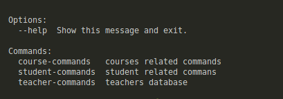
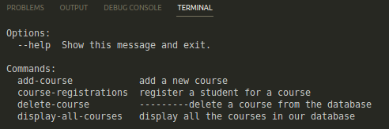
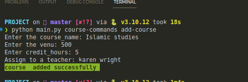
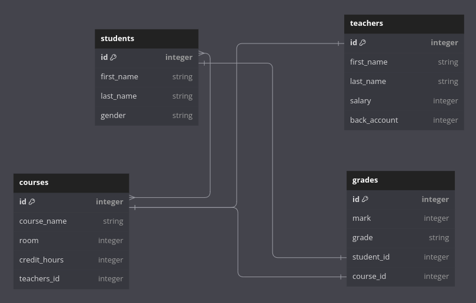

# CLI School Management System


---

## Introduction

this project strives to create a versatile SMS system that empowers admins to efficiently oversee student and teacher profiles, administer courses. using powerful tools like SQLAlchemy, Alembic migrations, and the `Click library` for a user-friendly command-line interface (CLI).

## Table of Contents

- [Features](#features)
- [Prerequisites](#prerequisites)
- [Project Setup](#project-setup)
- [Usage](#usage)
- [Entity Relationship ](#entity-relationship-diagram)
  - [Relationships](#methods)
- [Author & License](#author--license)

---

## Prerequisites

The packages are included in the `Pipfile`, and can be installed through it into the virtual environment.

- Python3 v3.10 +

- SQLAlchemy v2.0.20

- Alembic v1.12.0

- Faker v19.3.1

- click

---

## Features

### 1. Teacher Management

- **Add Teacher**: Add a new teacher to the system.
- **Delete Teacher**: Remove a teacher from the system and reassign their courses to another teacher.
- **Update Teacher**: Update a teacher's information (first name, last name, salary, bank account).
- **Display All Teachers**: View a list of all teachers in the system.
- **Teacher Courses**: Display the courses taught by a specific teacher.

### 2. Student Management

- **Add Student**: Add a new student to the system.
- **Delete Student**: Remove a student from the system, including their grades.
- **Update Student**: Update a student's information (first name, last name, gender).
- **Display All Students**: View a list of all students in the system.
- **Student Courses**: Display the courses taken by a specific student.

### 3. Course Management

- **Add Course**: Add a new course to the system and assign it to a teacher.
- **Delete Course**: Remove a course from the system.
- **Display All Courses**: View a list of all courses in the system.
- **Course Registrations**: Register students for courses.

### 4. Grade Management

- **Grade a Student**: Assign a grade to a student for a specific course.

---

## Project Setup

### 1. Clone the repository

```python
git clonehttps://github.com/Bisinle/CLI_School_Management_System
```

### 2. Navigate to the project's directory

```python
cd CLI_School_Management_System
```

### 3. Install required dependencies

The root directory of this repository contains the `Pipfile` with all the required dependencies. To install them into your virtual environment, run this command from the `root` directory:

```python
pipenv install
```

If `pipenv` is not already installed, you can do so using `pip`:

```python
pip install pipenv
```

### 4. Activate the virtual environment

```python
pipenv shell
```

### 4. Run `main.py` for testing

```
python main.py
```

---

## usage

- after running the above commane, you should see this

  

- choose one of the displayed commands to diplay the specific options

  

- add a course to the course table

  

---

## Entity Relationship



### Student Class:

The Student class represents the "students" table in your database.
It has a one-to-many relationship with the "grades" table. This means that each student can have multiple grades associated with them, typically from different courses.

### Teacher Class:

The Teacher class corresponds to the "teachers" table in the database.
There's no direct relationship defined in this class, but it's implied that teachers may be associated with courses through the "courses" table.

### Course Class:

The Course class represents the "courses" table.
It has a many-to-one relationship with the "teacher" table. This implies that multiple courses can be taught by a single teacher.
It also has a many-to-many relationship with the "student" table. This suggests that multiple students can enroll in the same course, and a student can be enrolled in multiple courses.

### Grade Class:

The Grade class corresponds to the "grades" table in your database.
It has a one-to-many relationship with the "students" table, meaning each grade entry is associated with a single student.
It also has a one-to-many relationship with the "courses" table, indicating that each grade entry is related to a specific cours

---

## Author & License

Authored by [Abdiwadud Mohammed]

Licensed under the [MIT License](LICENSE) - see the [LICENSE](LICENSE) file for details.
